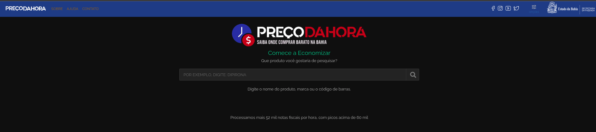

# Preço da Hora Bahia - Integração com API (Java)

Este projeto é uma implementação em Java que interage com a API privada do [Preço da Hora Bahia](https://precodahora.ba.gov.br/) para buscar produtos e preços com base em termos de pesquisa e localização (latitude e longitude). O Preço da Hora é um sistema desenvolvido na Região Nordeste do Brasil para fornecer informações precisas e atualizadas sobre os preços praticados no mercado local. O sistema permite que cidadãos acessem informações sobre mais de 500 mil produtos comercializados em toda a Bahia.


## Principais Características
- Cobertura Abrangente: Acesso a preços de produtos de até 180 mil estabelecimentos em 417 municípios baianos.
- Alta Frequência de Dados: Processa, em média, 3,8 milhões de notas fiscais diariamente, com picos superiores a 4,6 milhões.


## Sobre os Dados
Os dados apresentados são oriundos das Notas Fiscais do Consumidor Eletrônicas (NFC-e, modelo 65) e das Notas Fiscais Eletrônicas (NF-e, modelo 55), autorizadas pela Secretaria da Fazenda do Estado da Bahia (SEFAZ-BA). As informações incluem preço, descrição do produto e código de barras, e são baseadas nas notas fiscais emitidas pelos estabelecimentos comerciais.

- Dados Públicos: Os preços e descrições dos produtos são obtidos diretamente das NF-e e NFC-e e são de responsabilidade dos contribuintes.
- Política de Preços: Cada fornecedor é responsável por definir, manter, alterar ou extinguir sua política de preços e descontos.
- Imagens dos Produtos: As imagens são meramente ilustrativas e podem não corresponder exatamente à aparência real dos produtos.
- Exclusões: Preços de estabelecimentos com atividades principais de Alojamento (hotéis e pousadas) e Alimentação (bares e restaurantes) são excluídos para garantir melhor comparação.

## Funcionalidades da implementação

- Busca de produtos por nome ou código GTIN.
- Retorno de informações de preço com base na localização geográfica fornecida.
- Exibição de dados JSON formatados da API, incluindo informações sobre o produto e o estabelecimento.

## Pré-requisitos

- **Java 8** ou superior
- **Apache Maven** para gerenciamento de dependências


### Exemplo de Execução

No arquivo `Main.java`, você pode definir suas coordenadas e termos de busca para iniciar a pesquisa. O código abaixo faz a busca de um produto com o termo "CAFE".

```java
public class Main {
    public static void main(String[] args) {
        // Definir coordenadas (Latitude e Longitude de um ponto na Bahia)
        String latitude = "-12.2711";
        String longitude = "-38.9684";

        // Instanciar a classe PrecoDaHora e PrecoDaHoraService
        PrecoDaHora precoDaHora = new PrecoDaHora();
        PrecoDaHoraService precoDaHoraService = new PrecoDaHoraService(precoDaHora, latitude, longitude);

        // Termo de busca
        String termo = "CAFE";

        // Buscar produto e exibir resultados
        precoDaHoraService.buscarProduto(termo);
    }
}
```

### Explicação das Classes

#### `PrecoDaHora.java`
Essa classe realiza as seguintes funções:
- **Autenticação**: Coleta os cookies e o token CSRF necessários para realizar requisições POST.
- **Requisições HTTP**: Realiza requisições POST para enviar parâmetros como o termo de busca, código GTIN, coordenadas, etc.

#### `PrecoDaHoraService.java`
Essa classe gerencia a lógica de busca:
- **Buscar Produto**: Envia uma requisição para obter o código GTIN de um produto baseado em um termo de busca.
- **Requisição de Preços**: Usa o GTIN para buscar o preço e detalhes dos produtos nas proximidades da localização informada (latitude e longitude).
- **Exibição**: Formata e exibe o resultado da API como JSON.

### Parâmetros de Requisição

Na requisição de produtos, os seguintes parâmetros são enviados:

- `gtin`: Código GTIN do produto "obrigatório"
- `latitude`: Latitude do local de busca "obrigatório"
- `longitude`: Longitude do local de busca "obrigatório"
- `horas`: Período (em horas) para a busca de preços
- `raio`: Raio de busca em quilômetros (ex.: 15)
- `ordenar`: Critério de ordenação dos preços (ex.: `preco.asc`)
- `pagina`: 1,
- `processo`: "carregar",
- `totalRegistros`: 0,
- `totalPaginas`: 0,
-  `pageview`: "lista",

### Exemplo de Saída

Se um produto for encontrado, a saída JSON será exibida diretamente no console, formatada com indentação:

```json
{
  "produto": {
    "precoUnitario": 5.4,
    "gtin": 7898286200039,
    "anp": null,
    "tipoNFe": 55,
    "desconto": null,
    "data": "2024-09-10 20:01:22-00:00",
    "unidade": "PCT",
    "precoBruto": 5.4,
    "codProduto": "7898286200039",
    "descricao": "CAFE EM PO",
    "foto": "https://api.precodahora.ba.gov.br/v1/images/7898286200039",
    "intervalo": "há 1 hora(s), 4 minuto(s) e 35 segundo(s)",
    "ncm": 21011110,
    "ncmGrupo": "BEBIDAS NAO ALCOOLICAS",
    "cod_nfce": "2200791560",
    "precoLiquido": 5.4
  },
  "estabelecimento": {
    "telefone": "75992382615",
    "bairro": "JARDIM CRUZEIRO",
    "municipio": "FEIRA DE SANTANA",
    "latitude": -12.2425288,
    "cnpj": 46436539000199,
    "cep": "44024312",
    "nomeEstabelecimento": "T M M MURITIBA ALIMENTOS LTDA",
    "uf": "BA",
    "distancia": 3.2622,
    "endNumero": "226",
    "endLogradouro": "RUA DOUTOR JOAQUIM LARANJEIRAS",
    "codMunicipio": 2910800,
    "longitude": -38.9752176
  }
}
```

## Contribuindo

Contribuições são bem-vindas! Se você encontrar algum problema ou tiver sugestões de melhorias, por favor, abra uma issue ou envie um pull request para o repositório. Ao contribuir, siga o estilo de código existente, as convenções de commits e envie suas alterações em uma branch separada.

## Licença

Este projeto está licenciado sob a [MIT License](LICENSE).

